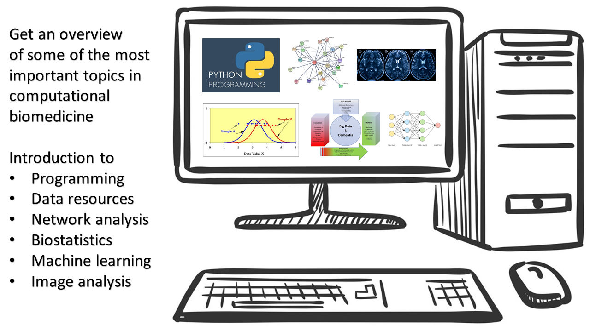

# Introduction to Computational Biomedicine   and Machine Learning

### Short Course summary  

The course will introduce the students to computational biomedicine. The goal of the course is to teach the students about important tools and data resources in this field, and to demonstrate through applications what basic knowledge in network analysis, mathematical models, statistics and machine learning they will need to work with and understand results from high-throughput biomedical experiments (imaging and omics). For each topic there will be text and/or video material and hands-on data analysis exercises in Jupyter notebook format.

### Course introduction

To get more familiar with the field of computational biomedicine, systems-level thinking and the use of quantitative approaches in biomedicine, use the links at the bottom to read more and watch our short introductory videos!

  <a href="./assets/p1.md">   Motivation    </a> •
  <a href="./assets/p2.md">   Systems-level thinking   </a> •
  <a href="./assets/p3.md">   Quantitative approach to biomedicine    </a> •
  <a href="./assets/p4.md">   Quantitative language    </a> •
  <a href="./assets/p5.md">   Learning goals    </a> •

