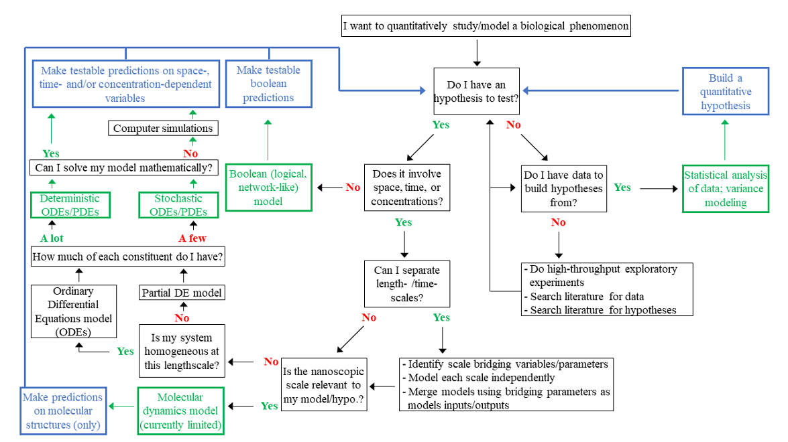

To get a glimpse of the complexity of introducing biological parameters in mathematical models, we recommend the excellent paper from Ann Babtie and Michael Stumpf [3]. This article, in addition, provides many examples of powerful yet simple models that have substantially contributed to our understanding of biological processes from the molecular to the eco-system level. There is a growing number of such works where mathematical modeling was able to provide mechanistic insight on complex processes that defied biological intuition.

The quantitative analysis of a biological phenomenon, whether at the systems level or for a distinct cellular pathway, requires the choice of a modeling framework (see Figure 1). This choice (green boxes) must be guided by simple questions which relate to the characteristics of the phenomenon we are studying, the type of input we have in hand, and the type of output we expect from the model (blue boxes).  
The first question to ask is “do I have a biological hypothesis to test?”. Indeed, a mathematical model requires a certain amount of knowledge on the system, for instance which proteins are interacting in a certain pathway. Otherwise, building the model will be impossible. But it also requires a certain number of unknown interactions or parameters: modeling a system for which everything is know will not allow to predict anything. Any model must thus be based on a solid ground of known mechanisms and parameters, and include some unknown mechanisms and hypotheses for which the model will allow to test quantitatively the plausibility. It is possible to compensate for the lack of a priori knowledge on the biological phenomenon of interest by using large datasets relating the output of the phenomenon to several measured variables. In this case, we are using biostatistical methods to infer significant correlations between the phenomenon and the measured variables. This type of modeling can be named “Data modeling”. Such methods include Boolean Network analysis, Machine Learning, Analysis of Variance, Principal Component Analysis, Independent Component Analysis and many others, and are described in detail in this course.  Such statistical analyses are important to constrain model development, for instance allowing to exclude from the phenomenon model variables that showed no statistical correlation with the phenomenon. However, the existence of correlations between variables and our phenomenon does not guarantee any causal relationship between the two. Even though techniques exist to infer causality from datasets (causal inference), they are not always applicable and are difficult to implement. And this is when mathematical modeling comes in handy: to predict non-trivial consequences of hypothesized causal relationships between model constituents that can be tested in experiments, to establish or reject the hypothesis. 

Once the model constituents (biological objects) and interactions (causal links) that can affect our phenomenon of interest have been identified and hypothesized, the next step is to identify the time- and length-scales relevant to the phenomenon, and thus to the model. Is the phenomenon fast enough so that nanosecond molecular dynamics matter? Are proteins involved stable over the course of the phenomenon, and if not, what are the timescales of protein homeostasis mechanism (synthesis, degradation, transport…)? Is the biological/biochemical system homogeneous in space? Do we have relevant long-range interactions with e.g. other cells in the body, or other organisms? Another important question is to ask whether there is a large number of the biological phenomenon regulators included in the model. Do we have enough of this kinase in any subcellular compartment of interest so that we can properly define a kinase “concentration”, or rather do we have only a few copies in which case we should model each of them individually? We can also choose to ignore space-time and copy number dependence of the phenomenon, ending up using a Boolean “all or not” description and a qualitative network-like model. But at this stage, it is important to keep in mind that getting rid of time, space and stoichiometry components in our modeling effort will limit the extent to which we’ll be able to make quantitative predictions (Figure 1, blue boxes). On the other hand, Boolean models allow to constrain networks structures, which is often a pre-requisite to other types of modeling strategies. Hence, we often need to combine different types of modeling. 

This is where we hit the core of the systems biology philosophy. Time- and length- scales can often - and should always - be separated, as much as possible. We often do this unconsciously, for instance when we use the mass-action principle to simulate the kinetics of formation/dissociation of a heterologous complex from its protein components. Indeed, an underlying assumption of mass action is that the dynamical interactions between the two proteins at the atomic level are fast enough so that we can ignore their details, consider these dynamics at equilibrium, defining a time-averaged dissociation constant that can be used for modeling at cellular time-scales (>milliseconds). We separate time-scales by assuming that a slowly-changing variable is a constant during a fast process, and that the transient states of the latter can be ignored when studying the dynamics of the slowly-changing variables. We separate length-scales through compartmentalization (e.g, describe nuclear and cell membrane dynamics with two different models). The point is that each particular space-time scale can be described by a model optimized for this scale, and for what we expect from the modeling. This way, we can build whole-cell models [3]. The last step is then to connect all modular models. To do so, it is necessary and sufficient that the model of each space-time scale uses as inputs outputs of the model(s) at finer spatial resolution and faster time-scales, and is able to output variables that shall be used as inputs at coarser resolution/slower time-scales. 

This modular, functional approach is the essence of systems biology.

Let’s come back to our train analogy to illustrate this approach. In order to travel from Oulu to Helsinki suburbs, we don’t need to know all the schedules of all very frequent suburban trains connecting Helsinki’s main station to our destination (the “fast” time-scales). And we don’t want to include these details in the modeling of our Oulu->destination trip. However, we want to be sure that there will be a suburban train after we arrive in the main station. Hence, we can model separately the Oulu->Helsinki trip on one hand (“slow” time-scales), and the suburban network on the other hand. Importantly, the second model should output the time of the last evening train, otherwise we won’t be able to connect both models. We note, finally, that these separations do not always overlap with pathways separations, there are slow and fast components as well as spatial compartmentalization in all pathways and depending whether pathways are coupled by slow or fast components, the consequences on the definition of the modular models might be different. 

  <a href="p1.md">   Mathematical models    </a> •
  <a href="p2.md">   Model parameters    </a> •

