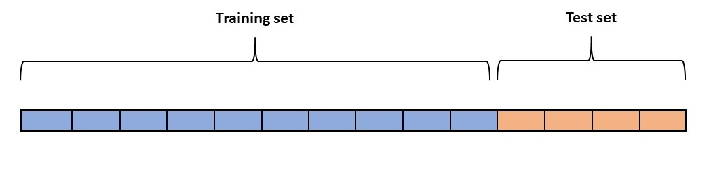

# Supervised machine learning

Supervised ML describes the way of solving problems explicitly by trying to pairing up some input data (features) to some output data (labels). The resulting moedl is essentially a mathematical function which maps from the features to the label. The major point to emphasize is the necessity to manually hand-labelling each sample (either a category or a numerical value).

## Training and testing your model

In short, we train a machine learning model by showing it many instances of labelled data (e.g. medical images of sick and healthy lungs), and the model learns to associate the features of a sample to its label. This is known as the training phase. Before we begin training however, we have to split our dataset into two non-overlapping sets: the training set and the test set. The training set is exclusively used for training the model, and the test set is used solely for evaluating how successful the model is. The motivation for dividing the dataset in this fassion is a methodological one: evaluating your model on the same samples it was trained on is fallacious, and severely overestimates the 'goodness' of a model. This is because the model can simply "memorize" the data without teaching it true generalization. Keeping the test set hidden during training mimics a real world situation. There is no single optimal split ratio, but if you have little data you should use a higher proportion for training. A typical split would be 75:25.

**Note:** when splitting the data into a train and a test set, it is important that each class is equally represented in both sets. In the most extreme case , the train set would only contain samples of class A and the test set only from class B. However, for large data sets, a randomized split is sufficient (but again this depends on the number of classes).

## Cross validation

Sometimes we find ourselves in the position of having multiple candidate models, or we simply want to adjust the hyperparameters of the model we already have chosen. We may also want to stop the training before the model starts to overfit. If we had a third partition of our dataset, call it a validation set, this would solve the above problems. But why not just use the training set for this, you might wonder? Because then we wouldn't have a way to evaluate the final model - we have already used up the test samples.

The solution of three separate sets is not very usual, because it requires a lot of samples. An alternative is cross validation. This works by sub-partitioning the training set into K sets of equal size. Proceed by training the model on all but one (K-1) subsets, and use the last for validation. Repeat this K number of times such that each of the subsets has been used a single time for validation. The average performance of this is a good estimate of the model performance. You can then do cross validation for all your candidate models, and select the one with the best validation performance. Finally you can give a proper evaluation of your model using the hitherto unseen test set.

