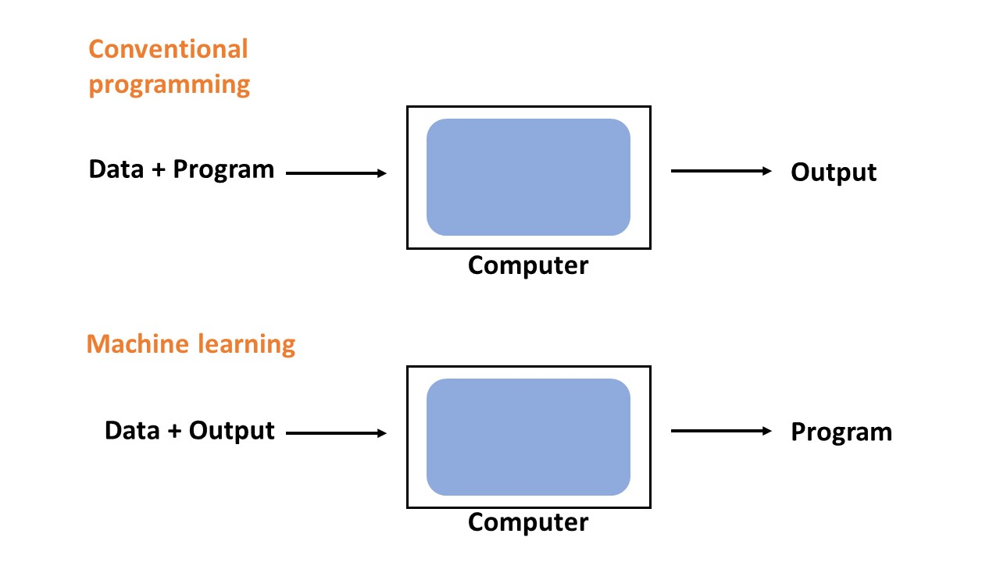
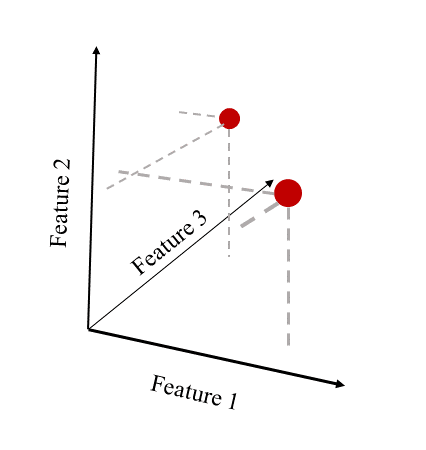

# Machine learning

## Motivation
Machine learning is making enormous impact in the biosciences, such as Deepmind's Alphafold to predict protein tertiary structures from sequence, and nothing suggests that ML's relevance in (bio)medicine will dwindle in the future. Seizing the opportunity early to learn these methods is a great resource for life science researchers. 

## What is ML?
One of the famous definitions of ML is A computer program is said to learn from experience E with respect to some class of tasks T and performance measure P, if its performance at tasks in T, as measured by P, improves with experience E. In other words, any program that learns about the world from experience. While the term machine learning has blown up in recent years, a more traditional term is *statistical learning*, as most algorithms essentially boil down to clever use of statistics. But it is 

How does ML differ from conventional programming?

No matter the task, we can *almost* always abstract it into either one of a few categories: 
- classification
- regression
- clustering

This might sound strange, but consider the array of choices you have at your 11th move in a game of chess. Selecting the optimal move is a matter of predicting . Even autonomous car driving is a matter of classification and regression.

Generally in machine learning (and data analysis generally), data can be abstracted to matrices where N rows are the samples and D columns are the features. This way to represent data prepares it for the vast majority of ML algorithms.

 There is no hard boundary between supervised and unsupervised learning.
 the only difference is our involvement in labeling samples for it.
 The basic principles of reducing an error function is still at the heart of it.
 Unsupervised learning has useful applications like feature selection, dimensionality reduction
 noise removal, visualization and preprocessing data prior to supervised learning.
 Unsupervised learning has useful applications like feature selection, dimensionality reduction
 noise removal, visualization and preprocessing data prior to supervised learning.

## Some important concepts in machine learning

Before we delve into specific learning algorithms, we introduce a few important concepts in ML. NOTE: The main point of the below text is not for you to memorize everything, but to expose you to concepts that you will encounter later in the course.

### Data representation
What is data? Depending on who you ask you might get a different answer, but for our purposes we can usually describe a single data point as a list (vector) of numbers, each number representing some feature. An inherently numerical feature could be continuous like height or a price of a product, or discrete like the number of mutations in a gene. Non-numerical features could include  your preference in movies or whether or not you use tobacco. But as you will learn, these features not only can, but actually require to be represented numerically before you can start to do machine learning.

In an abstract manner, we can visualize each feature as spacial dimension, and each data point is simply a point in this space,  referred to as feature space. Often we have tens or hundreds of features, and it is easy to lose intuition. Nonetheless, realizing that almost all data can be represented in this very generic manner, we can easily conceptualize any problem within this framework, whether it be health related data, shopping habits or government intelligence and crime statistics.

### Overfitting
Machine learning can almost always be abstracted to the fitting of a mathematical function to some experimental data. Intuition will have it that the closer we fit to our data points, the more successful we are. This intuition however is only true up to a certain point. After this point, we are essentially "perfecting" our model on trying to predict random noise and outliers. The image below clearly explains why a perfect fit usually is a symptom of overfitting: the blue line would severely misjudge the training point (red) between -5 and -4. For this reason, a simpler linear model is preferred: despite getting some of the training points wrong, it generalizes better.

Overfitting is the antithesis of proper generalization. As an analogy of overfitting, you can imagine a student who intensively memorizes every fact without genuine understanding, and thereby performs poorly on new problems (but near perfect on already seen ones). This is exactly how you can spot overfitting: the test error is much higher than the training error. Keep in mind though, that underfitting is also a possibility.
Parameters and hyperparameters

After a model has been selected, ML is all about finding a set of parameters which reduces the error function. For instance in linear regression, the parameters are the coefficients in the (what is actually being learned). This optimization is what the ML algorithm automatically finds. Another set of parameters, hyperparameters have to be predefined prior to training the model, and usually relate to the way the model is trained (for instance, what should the rate of learning be?).

### Cost function
It is always useful, and often necessary to quantify the model error. This is usually some variation of the deviation between prediction and ground truth (e.g. mean squared error, MSE). While training our data, we are looking for the model parameters which make the error as small as possible. We thus formulate a function, the cost function (also known as loss function), which is a function of the model parameters. The way a model is fitted (or trained) to some data is (explicitly or implicitly) through reducing the cost function. Just like we above conceptualized data features in a hyperdimensional feature space, we can do the same with model parameters. Thus we can imagine an energy landscape, where the y-axis represents the error. Different machine learning models have clever ways to navigate in this parameter landscape to reach a local minimum.

### A word on complexity

A useful distinction between models can be made by considering their complexity. Note that the word "complex" is not synonymous to "complicated". Complexity simply refers to something composed of many parts. In the context of ML, complexity is related to the number of parameters the model holds. The more parameters we have, the more complex is our model. Simple linear regression has a low number of parameters, but neural networks (especially deep neural networks) have plenty. When doing machine learning, you should generally test multiple models, always starting with the less complex (although more 'boring') alternatives. The reason for this is the general tendency for complex models to overfit as well as requiring more training data. A topic that usually comes up in discussions of complexity is bias-variance tradeoff: complex models have usually a low bias, but a high bias. Simple models have it opposite.

### The curse of dimensionality

Another common problem relates to the number of features (dimensionality) of the input data. Consider a 2-dimensional input space, where each feature can take the value 0,1 or 2. There are a total of 3^2=9 combinations of inputs. As we increase dimensions from 2 to 3 dimensions, we drastically increase the number of possible combinations of inputs from 9 to 3^3=27. Usually the dimensionality far supersedes 3 dimensions. If we want to get a representative sample of this state space, we need exponentially more and more training samples. Even more, many of the features will be completely irrelevant to our final prediction. This makes training on high-dimensional data challenging, but there are methods to deal with it (dimensionality reduction, covered under Unsupervised Learning).

### Preprocessing

A model can never be of higher quality than the data it has been trained on. This can be summarized in the mantra "Garbage in, garbage out", putting a well-deserved emphasis on ensuring that your data is of decent quality. Moreover, many ML models require the data to come in a certain format, or to be normalized first. In fact, a staggering amount of time of a machine learner's time goes to preparing the data to be modelled. For these reasons we need to review the data. Images should be plotted and inspected, tabular data should be plotted (histograms, line plots etc). It can also be useful to make note of the mean and median values (if the data is numerical), or normalize it (neural networks require normalization). For non-numerical data (such as classifications of healthy or sick), we need some way to translate  the categories into numbers, so they can be understood by a computer. For simple problems,we can simply replace the category with a '1' or a '0', while other problems require slightly more elaborate schemes (e.g. one-hot encoding).

### Feature selection and extraction

Traditional machine learning requires manual feature selection: you as a scientist need to decide which features you want to to gather or use as input to your ML model. There are also statistical techniques to select the "best" (most predictive) features from a dataset. Another related concept is feature extraction, in which new features are created by combining the available ones. This is often done through dimensionality reduction. In modern deep learning, feature selection and extraction has become minimal, by letting the algorithm do it automatically. This is known as feature learning.

### Regularization

The sensitivity of many learners to overfit can be handled using various techniques, colloquially known as regularization. Regularization techniques is used widely in linear regression to make it robust against outliers and noise, known as L1 and L2 regularization. Neural networks may also be regularized using dropout (random removal of neurons). We will look into regularization in more detail in the next section.