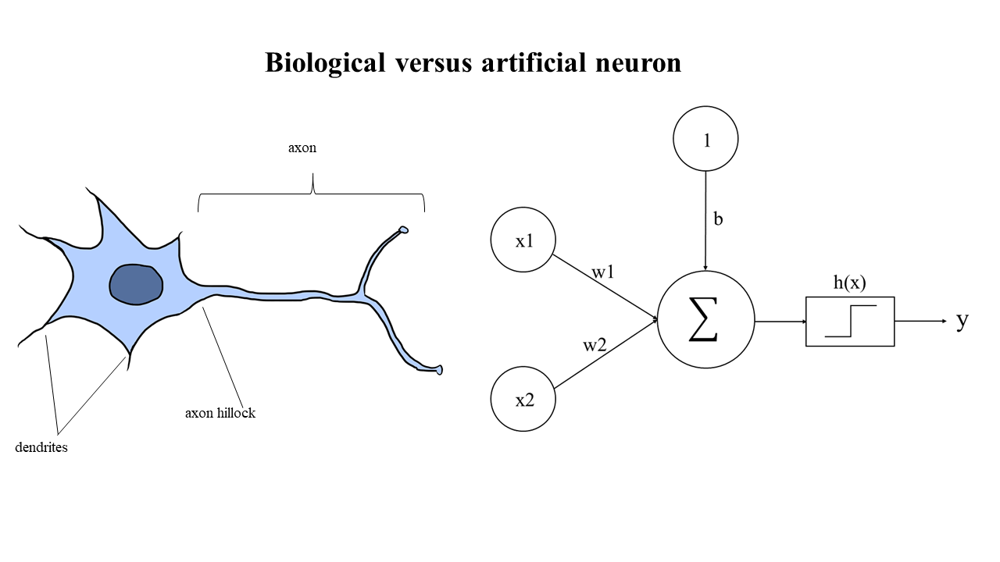

# Artificial Neural Networks

### Background
Artificial Neural networks (ANNs) make up a subset of algorithms within the broader category of machine learning. Like machine learning in general, we group ANNs into supervised and unsupervised based on our problem formulation. Neural networks can thus be taught to perform classification (including image segmentation), regression (including object detection) and in an unsupervised manner, like autoencoders. ANNs are extremely versatile in that the possible variation in model [architectures](https://towardsdatascience.com/neural-network-architectures-156e5bad51ba) (i.e. the number and type of layers, and how many neurons per layer) is virtually endless, and provided with enough data, they consistently outperform traditional ML models. For this reason and more, we have decided to seperate this particular class of ML algorithm into a distinguished submodule.

Broadly speaking, ANNs can be thought of as simple models of biological neural systems, in which layers of neurons propagate information from input to output, facilitated by connections ("synapses") between the neurons in adjacent layers. We model them simply enough as matrix multiplications. These networks can learn by adjusting the synapse strengths, much like the way animal brains learn through long term potentiation (LTP). Thanks to powerful computers, neural networks have started to compete with, and sometimes outperform humans in many complex tasks: for instance games like chess and Go. A [recent meta study](https://www.thelancet.com/journals/landig/article/PIIS2589-7500(19)30123-2/fulltext) also foudn that the overall performance of deep learning models is slightly better than that of human experts in medical diagnostics. In this module you will learn the basics of how neural networks function and how to apply them to real-life (bio)medical problems through exercises. 

### Useful resources
For a brilliant explanation of how neural networks learn, please see [this 3Blue1Brown video](https://www.youtube.com/watch?v=aircAruvnKk). Another recommended resource is [this interactive playground](https://playground.tensorflow.org/#activation=tanh&batchSize=10&dataset=circle&regDataset=reg-plane&learningRate=0.03&regularizationRate=0&noise=0&networkShape=4,2&seed=0.76120&showTestData=false&discretize=false&percTrainData=50&x=true&y=true&xTimesY=false&xSquared=false&ySquared=false&cosX=false&sinX=false&cosY=false&sinY=false&collectStats=false&problem=classification&initZero=false&hideText=false) by Tensorflow.