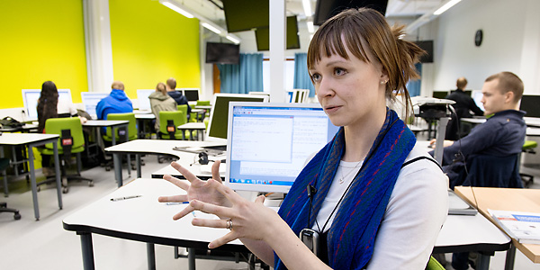

Copyright (c) 2019 OERCompBiomed - Open Educational Resources in Computational Biomedicine

# Introduction to Computational Biomedicine   and Machine Learning

This is the repository for the course CBM101: Introduction to Computational Biomedicine and Machine Learning, a collaboration within the [NordBiomed network](https://nordbiomed.org/).

Here you find exercises, code and documentation for the course. You will find more information about the Summer school testing this course at
https://nordbiomed.org/news/summer-school-2019-computational-biomedicine (e-learning modules will later be avaialble on the [Open edX](https://open.edx.org) platform at [Bibsys](http://www.bibsys.no/en/)).

## Content

[Introduction](#introduction)

[Instructions for users](#instructions-for-users)

[Instructions for teachers](#instructions-for-teachers)

## Introduction

### Quick Start
If you want to start right away, watch [this video](https://youtu.be/BF9OTam4nwk) (and optionally [this one](https://youtu.be/4KpD-L8-uZQ) first if you are new to computer science).

### *The big picture of CBM101*

CBM101 is part of the "Open Educational Resources in Computational Biomedicine"* (OERCompBiomed) project conducted by the NordBioMed.org and funded by [Erasmus+](http://ec.europa.eu/programmes/erasmus-plus/projects/eplus-project-details/#project/bc4e0bdb-aa64-4d5c-a7f2-26d68ec36647).

NordBioMed is a collaborative network in the field of Biomedicine(*) between the Universities of Turku, Eastern Finland (Kuopio), Bergen, Odense and Karolinska Institutet. The network was originally formed in 2013 to strengthen the individual biomedical teaching programs within the component universities and make them internationally more competitive by providing complementary activities from the partner universities. The network supports both student and teacher mobility, organises intensive courses and develops virtual online teaching and an information platform on the [Open edX](https://open.edx.org/) platform, supported by a GitHub repository.
Links that redirects to the study programme pages of each NordBioMed partner universities can be found [here](https://nordbiomed.org).

(*) Biomedicine covers those areas of human biology, chemistry and medicine that seek to explain the factors behind health and disease at the molecular and cellular level. This information is applied in the development of better diagnostics and treatments.

### What’s OERCompBiomed?

The Nordic network of Biomedicine educators NordBioMedNet has received a grant of 350 000 euros from Erasmus+ to develop biomedicine education. With the received money the network can start providing Open Educational Resource (OER) courses that are open for everybody. They will start by providing courses of Biomedical Ethics, Digital Pathology, Computational Biomedicine and machine learning.

The main objective of the project is to provide students in the field of biomedicine with modern, timely, up-to-date, and professionally relevant learning experiences that enable them to develop skills and competences in biomedical data management and use, and skills and competences to identify, analyse and handle ethical challenges within modern biomedicine.

As modern biomedical research produces massive data generated by high-throughput methods, students need to develop computational and analytical skills to manage and utilise “big data”. Moreover, knowledge and tools in bioethics are also increasingly important due to present rapid technological development in biomedicine with, for example, a new era of modern genomic/genetic research ripe with very critical and difficult ethical issues.  

[Excerpt from "Erasmus+ funding for development of Biomedical education" An interview with Merja Heinäniemia](https://www.uef.fi/en/-/erasmus-rahoitusta-biolaaketieteen-koulutuksen-kehittamiseen)

You can read more about OER in this [Foundations for OER Strategy Development](http://www.oerstrategy.org/home/read-the-doc/) document.

#### Major topics in the "Introduction to Computational Biomedicine and Machine Learning" part of OERCompBiomed project are:

- **Tools** (Python, R & friends) & **Data retrieval**  (see also https://computingskillsforbiologists.com)

- **Complex network analysis**  

- **Unsupervised learning**

- **Supervised learning**

- **Deep learning**  

   -- “Hello World” (UiB) + DeepCLIP (SDU) + DeepBind (UEF)

## Instructions for users
### Jupyter notebooks
The course is based on Jupyter Notebooks, a web-based framework for developing and presenting code-based projects (take a look at https://youtu.be/HW29067qVWk og https://youtu.be/2eCHD6f_phE for introductions to Jupyter Notebooks).

Throughout the course you will work with notebooks that contain various material and programming tasks. We recommend that you *make a copy of our notebooks before you are editing them*. In this respect you might adopt the naming convention `my_[name_of_notebook].ipynb`.

### Installation

You need to set up the Jupyter enrivonment on your computer or use one of the cloud options (e.g. [Binder](mybinder.org)) to run the exercise material. 

**Follow the instructions at [Setting up your system](setup.md) to get ready**

You will have to install different packages (mostly python) in your system along the course. 

_Note_: To access the course notebooks interactively without downloading any software we are planning to use [Binder](mybinder.org).

_Note_: For the more advanced modules of this program, you will need to have the jupyter notebook environment working on your commputer

### Folder structure
##### Topics
The main topics of this course are preceded by a capital letter. For instance, the content of the topic 'Tools and Data Resources' is available via [B_Tools-Data-Resources](B_Tools-Data-Resources).

##### Subtopics
Each topic has several subtopics as subfolders of the main topic folder. These contain the jupyter notebooks with the corresponding exercises, e.g. [CBM101/D_Basic-Concepts-in-Statistics/Probabilities-and-Distributions/ProbsAndDistr.ipynb](https://github.com/oercompbiomed/CBM101/blob/master/D_Basic-Concepts-in-Statistics/Probabilities-and-Distributions/ProbsAndDistr.ipynb)

### Get started - test your environment
* [Python, Numpy, Pandas, Matplotlib, Nibabel, Biopython and more](notebooks/0.0-test.ipynb): run through this notebook to check that your environment is OK.

## Instructions for teachers
This course is created and maintained as an international effort. The following guidelines describe the organization of the teaching material.

### General layout
The topics and subtopics mirrors the structure on [Bibsys](https://computational-biomedicine.mooc.no:18010). Each exercise notebook should have a specific entry with a link to it in Bibsys. 

A typical notebook should follow the structure of the given **[template](https://github.com/oercompbiomed/CBM101/blob/master/Template-Topic/template_subtopic1/template.ipynb)** and therefore contains a title with a short description, installation instructions, a cell for loading data and packages, and then exercises accompanied by code (if necessary) and questions.

### Folder structure
Topics start with a capital letter and have the subtopics organized as subfolders where teaching material such as the Jupyter notebooks is places.

### How to add a new exercise
- Create folder within the correct topic if necessary
- Separate notebook into small tasks 
- Follow the structure of the notebook template and include questions
- Upload to folder 
_Note:_ For comments, bug reports and suggestions use the __Issues__

   
