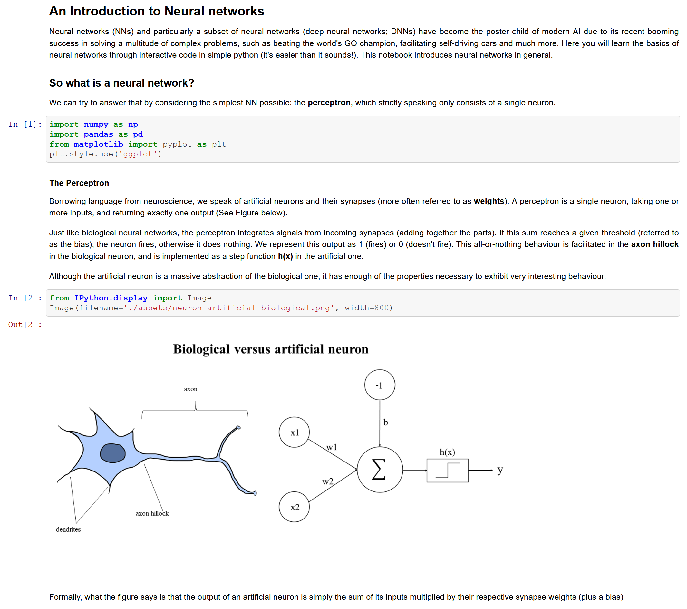
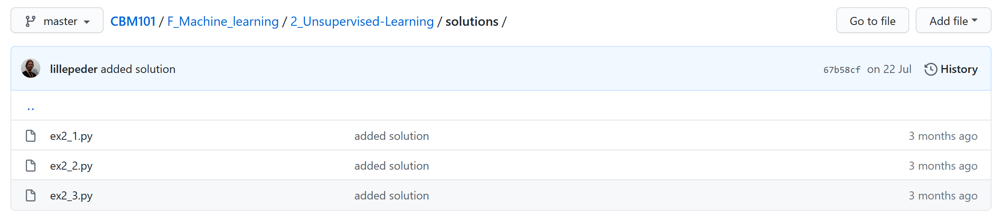
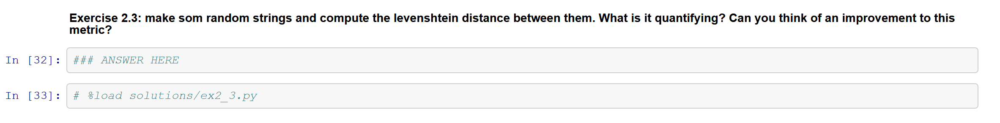

# Style guide to CBM101 jupyter notebooks

To keep a coherent style throughout the repository, we propose developers to adopt the style presented here. 

For a general template, see `H_Neural_Networks/1_Introduction_to_Neural_Networks.ipynb`:

## General

A good notebook should contain explanatory texts introducing topics and subtopics embedded between code examples, and regularly spaced exercises with solutions. Figures to break long blocks of text are very welcome! Markdown cells can be placed to explain the purpose of the following code block. Specificities about the code can be added 

## Organization

## Exercises and solutions

- Example answers should be provided for code exercises. Keep exercise text in **BOLD** like the above example.

- Each module (or submodule) should contain a directory `solutions` where the answer to an individual exercise is provided in a .py file.

- Answers are hidden, but can be unhidden using the `load` magic, e.g. `%load solutions/ex3_1.py` is the answer to exercise 1 of the third notebook in the (sub)module.

## Code

- Ensure the code is compatible with Microsoft Windows.
- Avoid running shell script code in jupyter notebooks with the `!` magic. If you need to add a new directory, simply make the change and do a git push.
- Keep code easy to read, logical variable naming etc.
- If you borrow code from online (stackexchange etc.), give proper credit.

## Introducing new libraries
- Do **not** create new virtual environments from a jupyter notebook.

- Avoid conda and pip installing libraries inside of a jupyter notebook. Rather add them to the environment.yml file (but if you absolutely have to, do it **properly** according to [THIS GUIDE](https://jakevdp.github.io/blog/2017/12/05/installing-python-packages-from-jupyter/).

